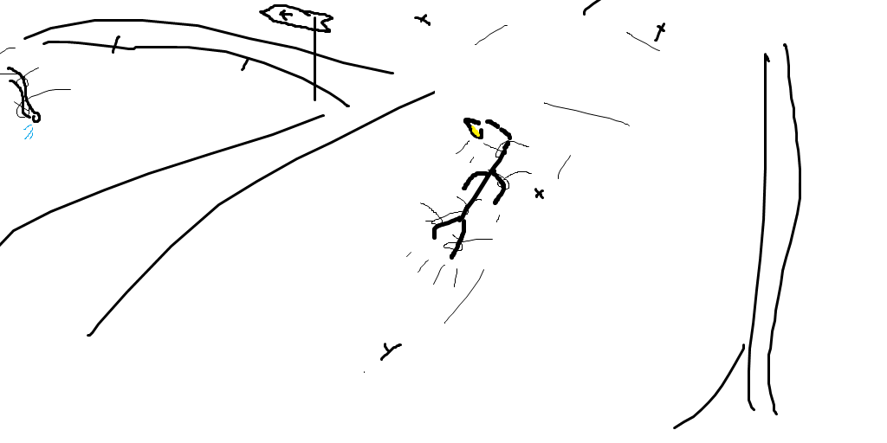
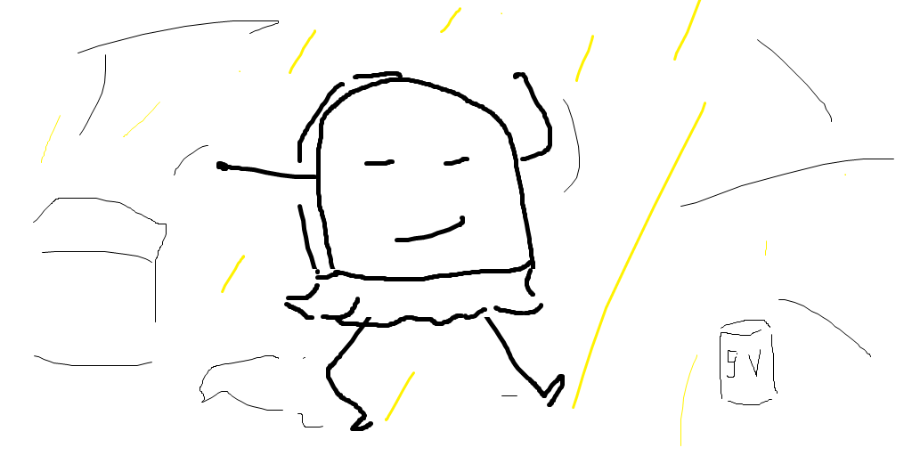

Пока не придумал

---

### 1

<audio controls preload="none">
  <source src="audio/mad_world.mp3" type="audio/mpeg">
  Your browser does not support the audio tag.
</audio>

Заброшенный город. Ночь. Тяжелое дыхание ветра сдувает  остатки следов с улиц, еще недавно населённых вязкой смесью под названием общество. То общество было прежним, не видавшим новый строй, его преимущества, оно было старым, оно было другим... Побитый временем бордюр плакал осколками камня, падающими в начало темноты. Эти улицы и вправду были темны - всего пара фонарей на каждую, будто кто-то экономил на этом, или специально не давал их ставить. Тень начиналась чуть ли не прямо под фонарем, а тянулась бесконечно долго, бесконечно далеко. Лишь старые окна задумчиво смотрели вдаль, ожидая перемен.

(рис 1. Бордюр плачет)

---

### 2

<audio controls preload="none">
  <source src="audio/riders_on_the_storm.mp3" type="audio/mpeg">
  Your browser does not support the audio tag.
</audio>

Послышались шаги. Медленные и нерасторопные, такие неуклюжие, как будто это не имеет значения. Это был Фонарь - высокий худой паренек с желтыми глазами, классической стрижкой и задумчивым лицом. Он шел маленькими шагами, засунув обе руки в карманы своего темного плаща, засматриваясь себе под ноги, на что-то совсем обычное и не требовавшее такого пристального внимания. Он шел и вдумчиво напевал:

> Into this house we're born
> Into this world we're thrown
> Like a dog without a bone
> An actor out on loan..

(рис 2. Фонарь гуляет)

---

### 3

<audio controls preload="none">
  <source src="audio/pacific.mp3" type="audio/mpeg">
  Your browser does not support the audio tag.
</audio>

На расстоянии всего в 2 дня пути от старого города во всю уже кипела новая жизнь. Все небо было ярким, сияющим в тысячах маленьких огней. Народ толпился у эскалаторов, уставших работать без передышки, ведущих их крохотные сердца в новый, ранее невиданный, мир. "Теперь то заживем!" - доносились крики. "Идея - свет! Пойдешь на свет - свет найдешь!" - ведал кто-то из маленькой кучки свояков, стоящих на стене в шестом углу. Все радовались живым вестям из "вещалки". Ведь сегодня вещали принятие нового решения - правила "Помоги ближнему". Да, правило скромное, но народу понравилось. Вот так, весело и оживленно, с тысячами улыбок на лицах, проходило начало уже четвертого праздника общества!

(рис 3. уставшие эскалаторы)

---

### 4

<audio controls preload="none">
  <source src="audio/come_together.mp3" type="audio/mpeg">
  Your browser does not support the audio tag.
</audio>

Гул, грохот, ранее весеннее утро, все смешалось воедино. Рассекая теплый воздух, взмахивая элегантными краешками, в направлении старого города летит стая струн - лучший транспорт последнего шага науки. Появилось сие средство передвижения совсем неслучайно, в следствии внебрачных половых связей электрического голубя с куском железа. Подумать только, кто-то же их захотел скрестить?... Сейчас струны автоматизированы и готовы доставить что угодно, и куда угодно. На сей раз, этим чем угодным были: братья стекла, три подруги бордюры, 40 сантиметровый шланг, старый фонарь, печь-мулатка и обманчивый уличный указатель. Именно они, по мнению нового строя, оказались тем самым ближним, нуждающимся в помощи.

Парнишка Фонарь стоял, покосившись чуть вперед, уткнувшись взглядом вниз, впрочем это его нормальное состояние. На этот раз он смотрел на свой левый черный ботинок. "Моржовый сапог" - прошептал он сам себе. И тут как тут, нечто схватило его за эту же ногу, потом за вторую, за руку, туловище... Это были струны. Один миг и Фонарь теперь в воздухе, летит на встречу новому миру. Летит с криком "У меня свои ноги под коленями!". Да, Фонаря то никто не спросил, это было не очень дружелюбно. 

(рис 4. улетучивание Фонаря)

### 5

<audio controls preload="none">
  <source src="audio/it_dont_mean_a_thing.mp3" type="audio/mpeg">
  Your browser does not support the audio tag.
</audio>

\- Ммм, Крышечка, а это что за блюдо? - с удивлением спросил Фонарь.

\- Тушенные иголки в собственном соку. Ты что никогда иголок не ел?

\- Та нет, как-то не приходилось.

\- Хей, ты чего такой кислый? Попробуй, они правда вкусные. Это лучшее что здесь есть, я сама выбирала!

Сказала тоненьким голосом Крышечка, уставившись маленькими зелеными глазами на своего собеседника. Темные тонкие брови приподнялись чуть-чуть вверх от удивления.

\- Хм, вкусно...

\- Ну я же говорила!

\- Микроволн не хватает, люблю вкус понасыщеннее. М, я хотел сказать спасибо..

\- Такой смешной. Если вдруг нужна будет помощь.. \*игра бровями\* .. я всегда рада помочь - чуть улыбаясь сказала Крышечка. 
И давно ты тут?

\- Недели полторы. Я просто прогуливался утром и вдруг меня схватили струны и понесли сюда. Эх, я тогда так испугался. Хоть бы спросили!

\- Не понимаю тебя, по-моему это нормально, не? Хотя.. Такая себе тема для разговора. Можем остаться тут... А можем... пройтись - подморгнула крышечка.

(рис 5. ужин)

### 6

<audio controls preload="none">
  <source src="audio/dumb.mp3" type="audio/mpeg">
  Your browser does not support the audio tag.
</audio>

Дождался. Время 28 часов вечера - вся нормальная техника уже идет на боковую, а я, снова прочитав свой серийный номер, собираюсь на улицу. И чего она меня только позвала? Хотя, гулять это мое призвание.. Интересно что она обо мне вообще думает? Ха-ха, Крышечка от флэшки и Фонарь, xD. Высокий, зато светло?

Пора выходить. Небо классное. Кажется, оно в этом крае специально светит ярче? Дежавю... Хотя странно, это же сколько электроэнергии нужно что бы включить каждую лампочку на небе?! Это неэффективно, это несерьезно! И вообще интересное место, да и Крышечка тоже, ей норм, а мне тут не нравится. В старом городе было лучше...

Фонарь внимательно посмотрел на свое лицо в зеркало, так будто это его привычка, будто он не мог этого не сделать, улыбнулся, и вышел на запланированную встречу.

(рис 6. зеркало)

### 7

<audio controls preload="none">
  <source src="audio/caravan_palace_lone_digger.mp3" type="audio/mpeg">
  Your browser does not support the audio tag.
</audio>

Два часа ночи. Деревья, лавочки, и снова лавочки, и снова деревья... У кого-то рядом играет музыка.

\- Выпьем? Спросила крышечка и стеснительно подморгнула.

\- С тебя тост - сказал Фонарь, ищя взглядом остатки "девятого вольта".

\- Кхм, ну это... эээм... За инкапсуляцию!

\- За инкапсуляцию!

И вот, в один миг, крепнет ум, яснеет мысль, твердеют намерения. Бесконечно можно смотреть на три вещи: на крышечку, снова на крышечку, и опять на крышечку. Как вдруг она кричит, пронзая задумчивое состояние.

\- Эй, братан, о чем думаешь? Смотри как могу!

Что? А мне нужно отвечать? - спросил себя Фонарь. И пока он думал что ответить, крышечка вдруг затанцевала. Это было нечто необычное, она двигалась, как заколдованная, словно земное притяжение на нее не действует. Ее красивые ножки будто скользили по земле, совсем не зависимо от тела. 

\- Классно танцуешь!

\- Спасибо - с улыбкой на лице сказала Крышечка.

Крышечка продолжала кружится в свете, покачивающего головой, Фонаря.

\- А ты чего не танцуешь?

\- Не мое это. Не умею.

\- Давай научу? - с большим энтузиазмом спросила Крышечка.

\- Давай как-то в другой раз. А вообще, за предложение спасибо - учтиво ответил Фонарь, сдерживая свой маленький страх всего нового, и сел на лавочку. 

Крышечка запрыгнула на лавочку. Взяла в руки свою банку девяти вольт и уставилась на небо, встав во весь рост, там, где обычно сидят. Небо - море маленьких огней, всегда радовало душу Крышечки как впервые. Фонарь сидел неподвижно уставившись на свои ноги. Заметив поворот Крышечки в его сторону, в голове пронеслось "Ты что-то говорила?", и Фонарь чуть наклонился в её сторону. Как вдруг, "Что? Поцелуй?? Ты хотела что-то спросить или так надо? Она правда меня поцеловала?", - поток мыслей было не остановить, чувства лили через край, а деление на ноль в этот момент официально стало возможным...

(рис 7. Крышечка танцует)

### 8

<audio controls preload="none">
  <source src="audio/bringin_home_the_rain.mp3" type="audio/mpeg">
  Your browser does not support the audio tag.
</audio>

Будь послушен, помолчи! Притворись тупым! Будь послушен, помолчи! Притворись тупым! Будь послушен, помолчи! Притворись тупым... снова, снова и снова. Слышу это тут. Слышу это еще раз. Понятное дело что Карп такого никогда не скажет, на то он и старый кирпич, но я постоянно слышу "побудь тупым".

Теперь нас трое. Костлявый лысый возле меня - это Ло-Пата, дурной сорвиголова, хоть и последнюю голову ему поменяли на совсем новую, я бы не считал это плюсом. Да и ручка у него некрасивая.

Рядом постоянный пессимист В.. М.. блин, я не помню как его зовут, парень что дал своим причендалам странные имена и постоянно мутит воду. Вообще он какой-то странный, постоянно приносит с собой фреш из жидкой пластмассы и говорит "Ло-Пата, на попей". Наверное у него вся семья такая с правильным питанием.

Нам теперь предстоит решать кого отправить на переработку - ненужных туда, ценных сюда. Но какое моральное право я имею это решать, какое право имеем мы вместе? Какое право имели те, которые меня сюда назначили? Аааа, эти мысли просто жуть, не даром же я шел к такому большому рейтингу. Не хочу! Не хочу помнить то что было раньше! Чего я добьюсь сегодня? Я принесу домой дождь?

Будь послушен, помолчи! - снова заговорил Карп. Те, кого мы отправляем на переработку, мы больше не можем им помочь, долг этих безнадежных - уйти, дав возможность появлению новых членов общества. Правила простые: тот, кого используют, тот нужен, а тот, кого не используют, тот не нужен. Сколько раз будешь нужен столько и окажись поле... 

Отсохнуться бы и забыться. Я всегда приношу домой дождь! Я всегда приношу домой дождь...

(рис 8. Липкий)

### 9

<audio controls preload="none">
  <source src="audio/placebo_where_is_my_mind.mp3" type="audio/mpeg">
  Your browser does not support the audio tag.
</audio>
\- кушать хочешь?

\- ?

\- кушать?

\- да

(рис 9. Салат из жидкой пластмассы с термопастой)

### 10

<audio controls preload="none">
  <source src="audio/chelou_dont_hate_on_me.mp3" type="audio/mpeg">
  Your browser does not support the audio tag.
</audio>

Знать бы, а не знаешь. Решение нужно принимать тут и сейчас, а узнаешь только в будущем. Люди... и времена... меняются очень быстро, иногда по нескольку раз в день.

Но ты ведь жаждешь сильных чувств? - я дам их тебе, просто позволь мне сделать мое дело. Безвозмездно угодить либо бескорыстно сделать приятное. Не бойся.

Но почему я этого хочу? Неужели я пытаюсь соответствовать твоему описанию мира? Это точно я? Как мне может нравиться то, что приносит боль? Я ее принимаю? Мой стакан наполнен не на половину, мой стакан наполнен дважды. Тот миг... это того стоило? Это повторится?

Не ненавидь меня. Не бойся. Я просто поменяю фильтр, пропущу мой стакан еще раз. К черту дорогой кофе и украшения, я люблю рыбу. Ох... Словил, убил, пожарил - это любовь? Нет, я не люблю рыбу, я люблю ее вкус. Я люблю твой вкус. Просто позволь мне сделать свое дело. Не бойся, не сопротивляйся, я дам тебе то что ты хочешь.

Мое сердце голодное. По-настоящему голодное, а я боюсь есть. Время открыться. Время мириться с миром. Я звоню себе, а никто не берет трубку. Не ненавидь меня, а то я возненавижу тебя в ответ. Перезвони!

(рис 10. Голод)

### 11

<audio controls preload="none">
  <source src="audio/fever_the_gost_source.mp3" type="audio/mpeg">
  Your browser does not support the audio tag.
</audio>

День, день и снова день. Не убежать мне от меня, он догоняет, такая вот традиция. Ждут, не ждут, пускай. Сей мир писан группой художников новаторов, красками взятыми из сердца, симфония размазанных по полотну мёртвых душ. Вместе веселее, возьмем кума... АААА кранты, полундра, у нас - семи нянек, дитя теперь без глаза!

Посей, пожни, продай, купи! Пустой карман без дна, размером с два полотна, затерт как футболка с глубокого детства, которую белая совесть не позволяет бросать, сношен множеством поколений, а главное пуст бездной. А правильно ли я поступил? Эх, торговец, странник, путник. Пламя твое, горит в моих черных глазах. Продай мне теплое мамино крыло, продай мне неразрушимую стену, продай глубокую яму, я посажу себя в свою же теплицу, закопаюсь, я огражусь! 

Посей, пожни, продай, купи! Надо творить, надо создавать, прямо сейчас! Я дам тебе кое-что, за весьма скромную плату. Я продам тебе теплое будущее со скидкой, только из печи, слышь, бери! Бери, купи два "завтра" за "сейчас", с тебя четыредцать кило "сейчас"! Изменись, стань кем хочешь! Бери, бери, бери, не пожалеешь, не обману! Все что тебе нужно это полный контроль! Я даю тебе смысл - курица это способ, способ яйца получить другое яйцо. Весь ты, вся твоя жизнь, это лишь способ!

Творцы мира, какой был план? Зачем те двое пинают дохлую собаку? Я вижу мир, он оглядывается на забытые справедливость и правду, он смотрит в мои глаза. Я слышу его. Друг, посмотри вокруг, всем все равно на значения, всех волнуют лишь мерила. Все меряют по-разному. Оглянись и скажи что происходит, опиши этот мир, это и будет его справедливость!

Нет, блага не портят людей, на самом деле они снимают с них маску. А я теперь богат, богат на "завтра", но в то же время беспомощен. Как вдруг - "завтра" в дефиците. Цена растет как на дрожжах. Все хотят, все бегут скупать, всем подай лес, всем кто сейчас смотрит на пни, всем тем, кто его срубил...

Пускай, пусть будет так, я король нищебродов. Карман пуст, зато у меня есть мое "завтра". Я вложился в потенциальную энергию. На кону моя порочная душа, мои светлые чувства, я ложу их на кровавый алтарь. Время кормить машину...

А правда что "поздно" не настанет? Ты же мое "завтра", скажи что меня ждет? Меня убьет? Строить ли стену? Останови меня, прикури, нежно обними, тихо произнося: "Ну конечно мы не виноваты, в том что не сумели как хотелось прожить. Ни ты, ни я..."

Заброшенный город? Вход тут?

(рис 11. Вход)
